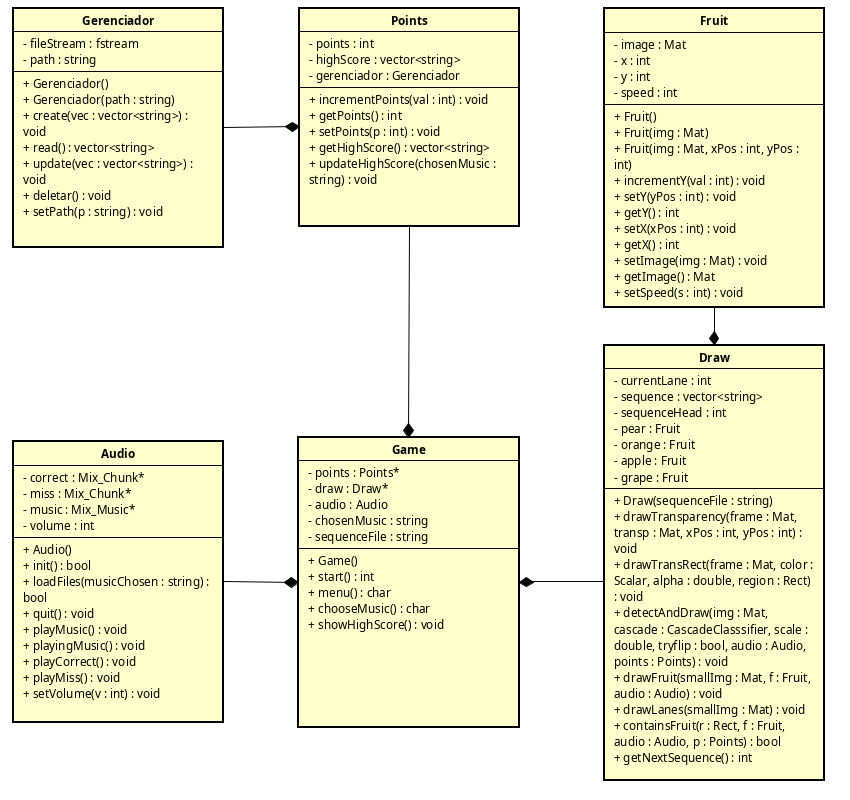

# Fruit Hero Project

## About
Projeto feito para disciplina *Programação Orientada a Objetos* da UFPB do curso de Engenharia de Computação

## How to Compile
**It needs at least C++17**   
To compile in Linux:  `` g++ main.cpp error/*.cpp src/*.cpp -I include/ -lSDL2_mixer `pkg-config --cflags opencv4` `pkg-config --libs --static opencv4` ``

## Class Diagram
